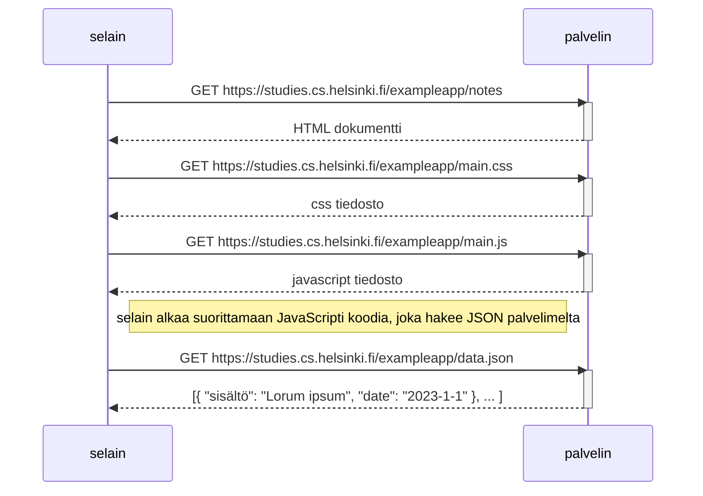

```mermaid
sequenceDiagram
    participant selain
    participant palvelin

    selain->>palvelin: GET https://studies.cs.helsinki.fi/exampleapp/notes
    activate palvelin
    palvelin-->>selain: HTML dokumentti
    deactivate palvelin

    selain->>palvelin: GET https://studies.cs.helsinki.fi/exampleapp/main.css
    activate palvelin
    palvelin-->>selain: css tiedosto
    deactivate palvelin

    selain->>palvelin: GET https://studies.cs.helsinki.fi/exampleapp/main.js
    activate palvelin
    palvelin-->>selain: javascript tiedosto
    deactivate palvelin

    Note right of selain: selain alkaa suorittamaan JavaScripti koodia, joka hakee JSON palvelimelta

    selain->>palvelin: GET https://studies.cs.helsinki.fi/exampleapp/data.json
    activate palvelin
    palvelin-->>selain: [{ "sisältö": "Lorum ipsum", "date": "2023-1-1" }, ... ]
    deactivate palvelin

```