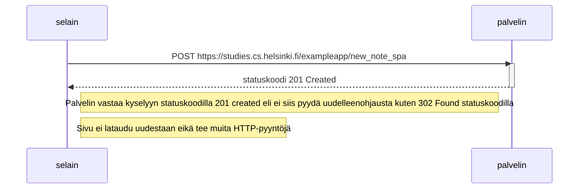

```mermaid
sequenceDiagram
    participant selain
    participant palvelin

    selain->>palvelin: POST https://studies.cs.helsinki.fi/exampleapp/new_note_spa
    activate palvelin
    palvelin-->>selain: statuskoodi 201 Created
    deactivate palvelin

    Note right of selain: Palvelin vastaa kyselyyn statuskoodilla 201 created eli ei siis pyydä uudelleenohjausta kuten 302 Found statuskoodilla

    Note right of selain: Sivu ei lataudu uudestaan eikä tee muita HTTP-pyyntöjä

```